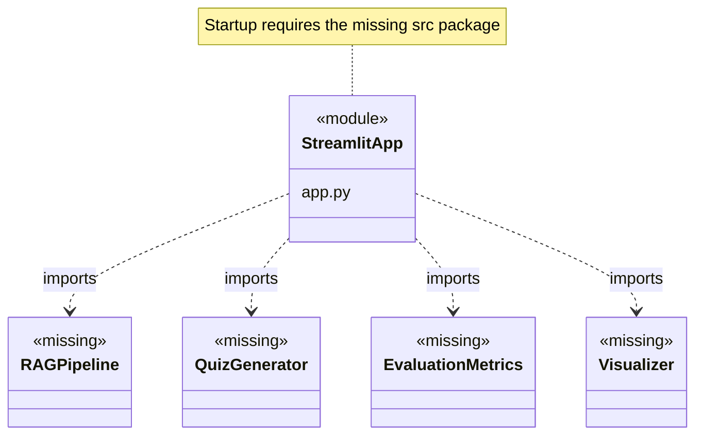

# RAG Knowledge Assistant for Teachers

A Streamlit interface designed for document-based educational question answering, summaries, quiz generation, and retrieval evaluation.

**Technology:** Python · Streamlit · Transformers · LangChain/LlamaIndex dependencies

## Features

- Provide document upload and question-answering screens.
- Expose document summary and quiz-generation controls.
- Show retrieval settings, pipeline metadata, and evaluation visualizations.

## Repository guide

| Path | Purpose |
|---|---|
| [app.py](app.py) | Streamlit interface and calls to the intended RAG pipeline. |
| [requirements.txt](requirements.txt) | Declared Python dependencies. |

## Requirements and current limitations

**The current checkout is incomplete.** `app.py` imports `src.pipeline.rag_pipeline`, `src.features.quiz_generator`, `src.evaluation.metrics`, and `src.utils.visualizer`, but no `src/` package is committed. Installing dependencies alone will not make the app start. Restore these modules and their required configuration/model assets before using the launch command.

The feature list describes the interface's intended workflow; backend implementation and end-to-end operation cannot be confirmed from the files currently present.

## UML diagrams

### Expected import dependencies

The diagram records the dependencies imported by app.py. The src modules are absent from this checkout, so these names describe expected interfaces rather than verified class implementations.



## Getting started

```bash
git clone https://github.com/IbrahimAbdelsattar/RAG-Powered-Knowledge-Assistantf-for-Teachers.git
cd RAG-Powered-Knowledge-Assistantf-for-Teachers
```

Use a Python virtual environment:

```bash
python -m venv .venv
```

Activate it with `source .venv/bin/activate` on macOS/Linux or `.venv\Scripts\Activate.ps1` in PowerShell.

```bash
python -m pip install -r requirements.txt
python -m streamlit run app.py
```
